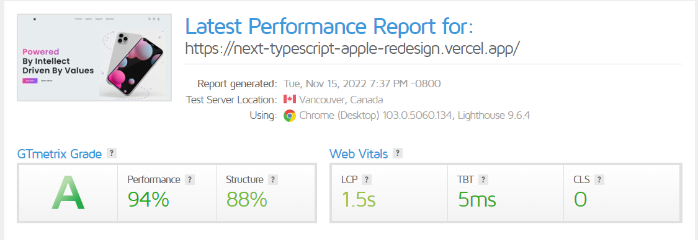

# Apple Website

Apple Website redesign and developed using Next, Typescript, Stripe.

## Features

- Users can visit the store and buy apple items of their choice.
- Secure payment gateway using Stripe.
- Google Auth enabled.
- CMS system using Sanity

## Tech

This application uses a number of open source projects to work properly:

- [Next] - Next.js is an open-source web development framework created by Vercel enabling React-based web applications with server-side rendering and generating static websites.
- [Stripe] -  Stripe provides APIs to accept credit cards, manage subscriptions, send money, run a marketplace.
- [Redux] - Redux is an open-source JavaScript library for managing and centralizing application state.
- [Sanity] - Sanity is the platform for structured content that lets your team work together in real-time to build engaging digital experiences across channels..

And of course this application itself is open source with every code available here in github.

## Installation

Requires [Node.js](https://nodejs.org/) v10+ to run.

Install the dependencies and start the server.

```sh
npm install
npm start
```

## Screenshot

##### Home


##### Products


##### Orders


##### Cart


##### Checkout


##### Summary


## Performance Test


## Hosted
The link for the finished website - [Click Here](https://next-typescript-apple-redesign.vercel.app/)

<!-- ## License

MIT -->
